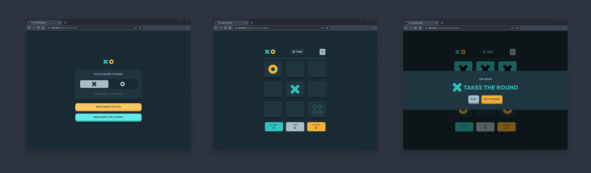

# Peeps - The card Game

The primary goal of the project was to learn and improve my skills by focusing on the game logic and following the specifications outlined in the design provided by frontendmentor.io. By working on this challenge, I was able to enhance my understanding of React, TypeScript, and front-end development concepts.

## The solution

Test the game with the URL below:

**⭐ Solution URL:** [https://www.jotto.dev/project/tic-tac-toe/](https://www.jotto.dev/project/tic-tac-toe/)

## Built with

- [React](https://reactjs.org/) - JS library
- [Vite](https://vitejs.dev/) - Frontend tooling

## Screenshots
